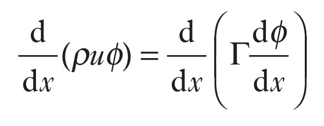
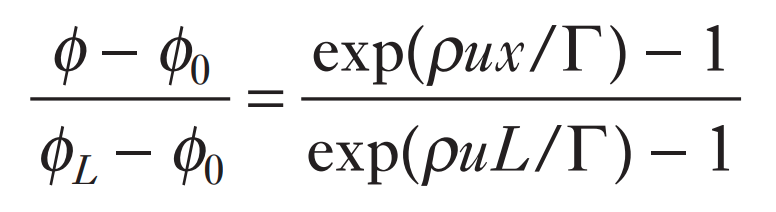
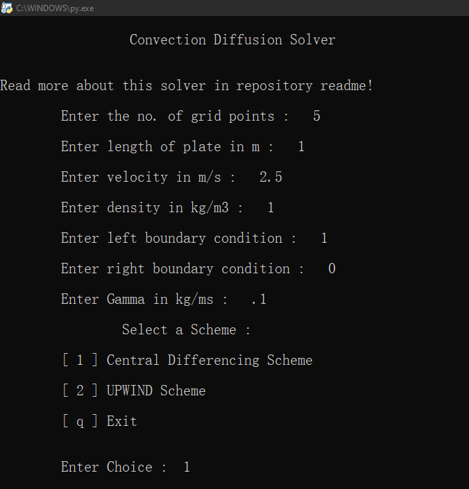
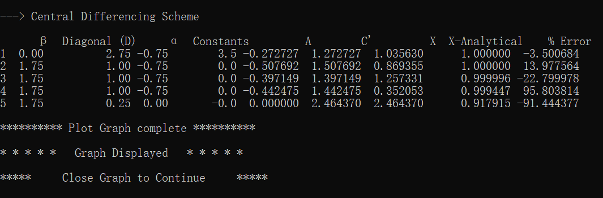
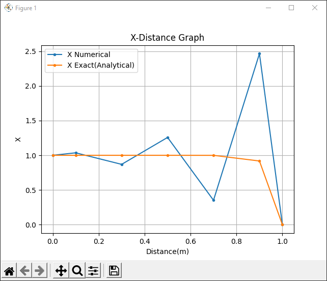
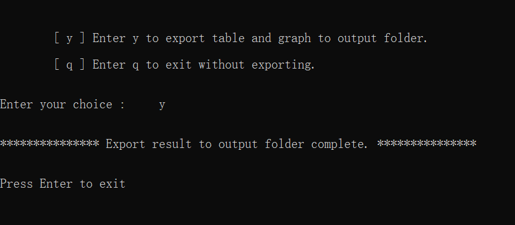

# Convection Diffusion-1D-Steady State solver
## Python code for Convection Diffusion in 1 Dimension Steady State

Read _[CD.pdf](CD.pdf)_ in the repository to understand the Convection Diffusion 1D steady state. If you want to study about Finite Volume Methods in detail then refer **'An Introduction to Computational Fluid Dynamics - The Finite Volume Method'** by _H K Versteeg and W Malalasekera._

Click on the following link to checkout the video to easily use this python code.

- [YOUTUBE](https://youtu.be/2x0NZ7Wg1Vo)

The _governing equation_ used in the python code is

The Analytical solution is given by 

The python code has all the necessary comments to understand the solver.

_**Note** : In this solver cross sectional area is not required as we deal in one dimension only, so we measure steady state convection diffusion across the length only._

## Motivation
To learn Python programming and use python packages.

## Dependencies
- [Python](https://python.org) 3.9.5

- [Pandas](https://pandas.pydata.org) 1.2.4

- [Openpyxl](https://openpyxl.readthedocs.io) 3.0.7

- [Matplotlib](https://matplotlib.org) 3.4.2

## Output
User input data :

Solution which is printed in tabular form :

New window of graph is showed (close graph to continue) :

Export result to output folder :

_**Note** : Previous saved result will be overwritten so copy the previous result to some other folder._

## License

[Apache License 2.0](LICENSE)

## Author

[Yahya Ansari](https://linkedin.com/in/yahya-ansari)
